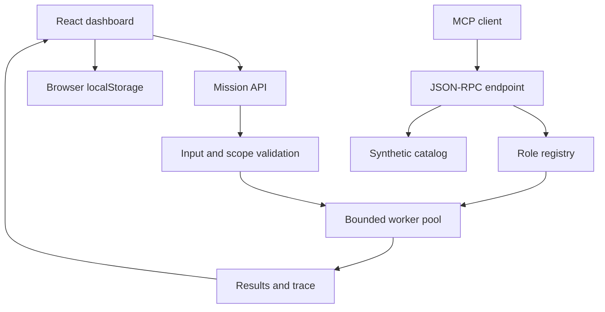
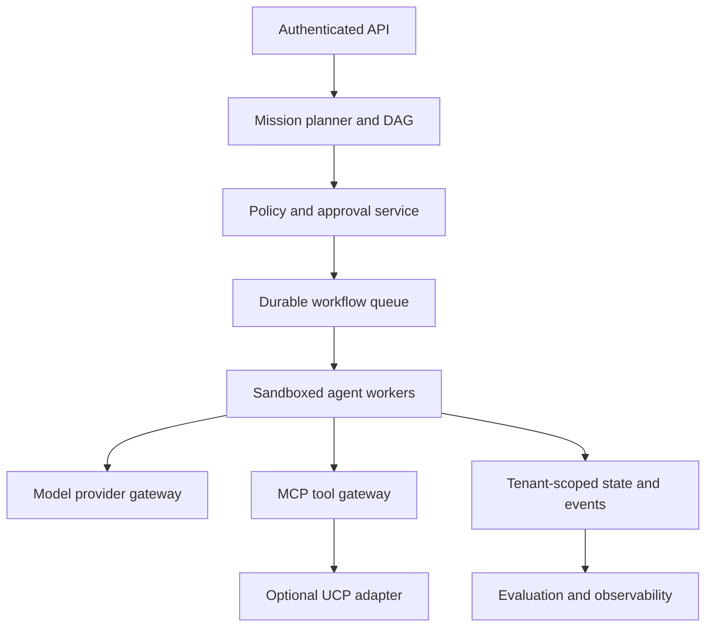

# Architecture and engineering decisions

## Current system

The application is a TypeScript/React control-plane prototype using Vinext/Vite and Cloudflare Workers-compatible build output. It contains 1,000 logical registry entries, 100 job titles, ten departments and ten teams per department. Job titles are generic simulated positions, not real people.

The worker pool is request-local, not distributed. Concurrency is capped at 32 and requests allocate at most 1,000 identities. Each output is a deterministic template; no language model, real retrieval, external tool or enterprise system is invoked. The declared knowledge tools are capability labels, not actual connectors. Browser storage retains only the latest 20 runs and is not an immutable audit log.

## API contracts

`POST /api/run` accepts `{task: string, count: integer, concurrency: integer, action?: string}`. Task length 1–8,000; count 1–1,000; concurrency 1–32. Returns run ID, timing, peak concurrency, completion/denial counts, per-role results and orchestration events. Payment completion is denied. Other scopes do not initiate external activity.

`POST /api/mcp` supports initialize, ping, initialized notification, tools/list and tools/call. Read-only `agents_list` supports offset and limit (maximum 100). `catalog_search` returns a synthetic item. Protocol version 2025-03-26 is declared; full transport/session and SDK conformance are not established. Unknown methods return -32601. Google UCP and remote A2A delegation are not implemented.

## Intended production architecture

A role is a versioned configuration: system instructions, allowed tools, input/output schema, model policy, evaluation suite and cost ceiling. Many roles may share one model server. A 1,000-agent registry does not imply 1,000 GPUs or simultaneously loaded models.

## Framework choices for further development

| Layer | Recommended direction | Decision reason | Adoption gate |
|---|---|---|---|
| UI | Retain React/TypeScript; evaluate framework migration only if needed | Preserve existing interface and typing | Accessible desktop/mobile workflows |
| Model orchestration | Explicit DAG/state machine; evaluate LangGraph for stateful workflows | Inspectable task state and retries | Replay, cancellation and deterministic routing tests |
| Durable execution | Temporal or a queue-backed workflow service | Leases, retries, recovery across crashes | Failure injection and duplicate-delivery tests |
| MCP | Official TypeScript or Python SDK, compatible pinned stable release | Replace handwritten protocol shim | SDK client interoperability suite |
| ML services | Python/FastAPI when Python ML libraries are required | Separate ML runtime from UI hosting | Typed OpenAPI contracts and deployment tests |
| Persistence | PostgreSQL plus migrations; object storage for artifacts | Tenant-scoped durable records | Backup/restore and isolation tests |
| Search | PostgreSQL vector support initially; graph store only when graph queries justify it | Reduce operational complexity | Retrieval recall and permission benchmarks |
| Models | Local OpenAI-compatible inference or approved cloud provider | Provider portability | Quality, token-cost, timeout and privacy tests |
| Observability | OpenTelemetry-compatible traces and metric store | Correlate mission, agent, model and tool spans | No secrets/PII in telemetry |
| Evaluation | Versioned datasets and independent acceptance checks | Measure actual task quality | Held-out success and adversarial regression thresholds |
| Identity | OIDC with application RBAC/ABAC | Tenant isolation and least privilege | Cross-tenant negative tests |
| Deployment | Containers for long-running workers; existing Worker for lightweight gateway | Runtime and memory boundaries | Staging load and recovery tests |

These are roadmap decisions, not installed capabilities. Validate current stable versions and licenses before adoption. Avoid deploying GPU workloads inside Cloudflare Workers.

## Repository map

- `app/page.tsx`: dashboard and browser state.
- `app/api/run/route.ts`: offline mission API.
- `app/api/mcp/route.ts`: minimal MCP gateway.
- `lib/engine.ts`: organization registry and bounded executor.
- `tests/engine.test.ts`: orchestration checks.
- `docs/`: engineering, product and program documentation plus Pages overview.

## Engineering risks

Request-local execution cannot recover after disconnects or process failure. LocalStorage can exceed quota. Generated role titles do not implement distinct reasoning workflows. Model outputs will require evidence validation and adversarial evaluation. Public endpoints need real abuse controls before connecting paid models. Server-side authorization must accompany identity; frontend controls are insufficient.

## References

- https://modelcontextprotocol.io/docs/sdk
- https://developers.google.com/universal-commerce-protocol
- https://docs.github.com/en/pages/getting-started-with-github-pages/what-is-github-pages
