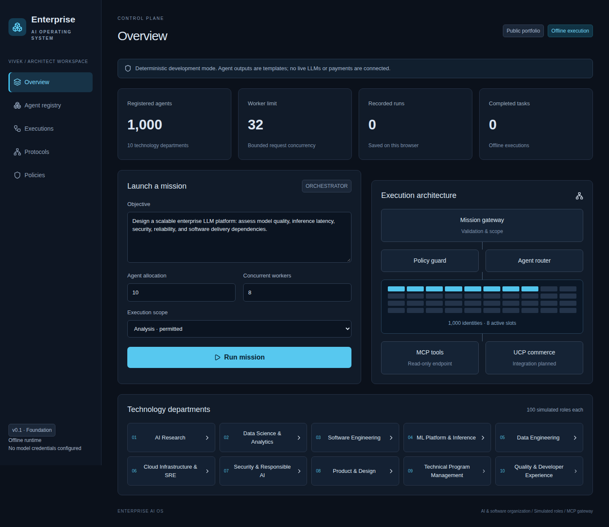
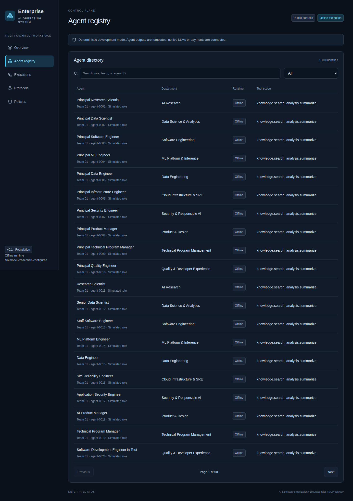
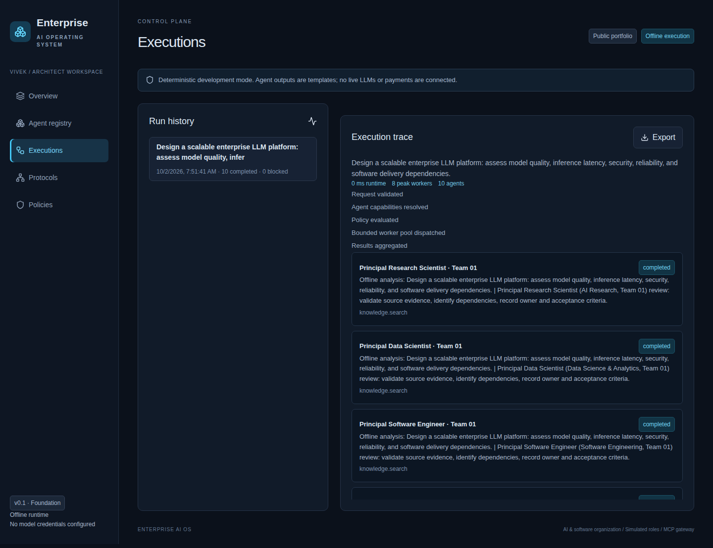

# Enterprise AI Operating System

**An inspectable AI/software organization control-plane foundation with 1,000 simulated positions, bounded orchestration and a minimal MCP tool gateway.**

[GitHub Pages overview](https://vivekmlresearch.github.io/enterprise-ai-os/) · [Open working dashboard](https://enterprise-ai-os.vivekmlresearch.chatgpt.site) · [Architecture](docs/ARCHITECTURE.md) · [Product case and benefits](docs/PRODUCT-CASE.md) · [16-week program plan](docs/PROGRAM-PLAN.md) · [MIT license](LICENSE)

> Status: offline prototype. The registry contains 1,000 logical positions, not 1,000 connected LLM agents. Outputs are deterministic templates. No real model, distributed worker cluster, UCP merchant or A2A service is connected. 

## Version 2 — working AI team

**Release status: requirements prepared; implementation pending.** The current public dashboard remains the offline V1 prototype. V2 will activate 5–10 genuine specialist agents; the 1,000-role registry remains the organizational blueprint.

### Mission and scope

A user submits an objective, deliverables, deadline and spending limit. A coordinator creates a reviewable dependency plan, delegates work to specialists, gathers evidence and sends the final result to an independent reviewer. Initial demonstration: assess an enterprise LLM platform and produce an architecture, cost analysis, delivery plan and QA review.

| ID | Requirement | Acceptance evidence |
|---|---|---|
| V2-01 | Versioned role contracts for coordinator, Principal Engineer, Principal Data Scientist, Analyst, Product Manager, TPM, QA and Security Reviewer | Each active role specifies responsibilities, model, permitted tools and structured output |
| V2-02 | Cloud model adapter and local inference adapter | Real responses from each configured endpoint; unavailable providers produce explicit errors |
| V2-03 | Dependency-aware coordination | Downstream tasks consume validated upstream outputs; final review is recorded |
| V2-04 | PostgreSQL mission, task, output and event storage | Mission survives refresh and resumes after controlled interruption |
| V2-05 | Approved MCP tools for repository inspection and document retrieval | Tool results carry provenance and permissions are enforced |
| V2-06 | Isolated code execution with limited resources and network access | Timeout and forbidden access tests; external changes require approval |
| V2-07 | Retry, timeout, cancellation and resumable checkpoints | Controlled failures produce correct task transitions without silent loss |
| V2-08 | Authenticated live execution with protected server-side credentials | Public visitors can use a synthetic demonstration; secrets never reach browser or repository |
| V2-09 | Mission budgets and concurrency limits | Admission limits, actual usage and estimated cost displayed; spending limits halt further execution |
| V2-10 | Organization and mission workspace UI | Registered, connected and running roles are distinct; dependencies, outputs and review feedback inspectable |
| V2-11 | Evaluation and telemetry | At least 30 representative missions compared against human or single-agent baseline |
| V2-12 | Reproducible release documentation | Setup, API contracts, screenshots, dependency licenses and limitations verified |

### Implementation preparation

Retain the existing React/TypeScript interface. Implement provider adapters, role contracts, a dependency scheduler and persistent repositories behind explicit interfaces. Evaluate orchestration frameworks during the first milestone before adding a new runtime; durable execution and enterprise-scale adapters are later work.

Proposed components: role definitions, provider adapters, mission coordinator, task state machine, persistence repositories, MCP gateway, approval service, usage accounting and evaluation harness. Planned task states: queued, ready, running, awaiting approval, completed, failed and cancelled. Store prompt/model versions, evidence references and review outcomes with each task.

Planned API contracts (not yet implemented): create/list missions; inspect mission/tasks/events; approve a pending action; cancel or resume a mission; list agent connection states. Approval records must bind the exact action and parameters. Retries must not duplicate external side effects.

### Four-week pilot plan

This is a scoped pilot track within the broader sixteen-week roadmap, assuming a dedicated small team and available model infrastructure.

| Milestone | Proposed dates | Accountable role | Exit criteria |
|---|---|---|---|
| Contracts and model execution | 5–11 October 2026 | Principal Engineer / ML Engineer | Versioned contracts and three genuine specialists; provider errors handled |
| Coordination and persistence | 12–18 October 2026 | Platform Engineer | Five or more specialists complete dependent tasks; restart recovery demonstrated |
| Tools and controls | 19–25 October 2026 | Security / Platform Engineer | Approved MCP tools, isolated execution, approval gates and spending limits |
| Evaluation and pilot release | 26 October–1 November 2026 | QA / Product Manager / TPM | Thirty evaluated missions, failure tests, revised screenshots and reproducible setup |

### Release gates and product measures

Release only after at least five connected specialists complete an end-to-end mission, dependency validation and persistence pass, approval-required writes stay blocked, and retry/timeout/cancellation tests pass. Publish the evaluation dataset, acceptance rubric, failure count, reviewed quality, wall-clock time and cost per accepted mission.

Existing targets—25% faster reviewed completion, 30% less coordination effort and 95% required trace coverage—remain hypotheses. V2 must establish a baseline and report observed results before claiming benefits.

### Dependencies and boundaries

Model credentials or a reachable local inference service, PostgreSQL hosting and an isolated execution environment are implementation dependencies. No live model access is available merely from publishing these requirements. Distributed 1,000-agent execution, tenant administration, A2A interoperability and optional Google UCP merchant workflows remain V3 scope. MIT licensing continues for project-authored code; dependencies retain their own licenses.

## Interface screenshots





Captured from the public dashboard. Outputs are deterministic offline templates.

## Why this project

Enterprise AI work requires more than model prompting: task state, role ownership, tool permissions, failure recovery, cost accounting and evidence-based acceptance. This repository establishes the interface, contracts and roadmap for those capabilities while making current limitations visible.

## Organization

100 generic job titles are assigned across ten departments and repeated across ten teams per department, for 1,000 positions. Stable IDs distinguish repeated roles.

| Department | Example roles |
|---|---|
| AI Research | Principal Research Scientist, LLM Research Scientist |
| Data Science & Analytics | Principal Data Scientist, Data Analyst |
| Software Engineering | Principal Software Engineer, Distributed Systems Engineer |
| ML Platform & Inference | Principal ML Engineer, GPU Systems Engineer |
| Data Engineering | Principal Data Engineer, Knowledge Graph Engineer |
| Cloud Infrastructure & SRE | Principal Infrastructure Engineer, SRE |
| Security & Responsible AI | Principal Security Engineer, AI Red Team Engineer |
| Product & Design | Principal Product Manager, UX Researcher |
| Technical Program Management | Principal Technical Program Manager, AI Program Manager |
| Quality & Developer Experience | Principal Quality Engineer, AI Evaluation Engineer |

Role names are taxonomy only. Distinct role prompts, model-backed workflows and management hierarchy remain roadmap work.

## Implemented vs planned

| Capability | Implemented | Next step |
|---|---|---|
| Role registry | Search, department filters, pagination and stable IDs | Versioned role contracts and capabilities |
| Orchestration | Request-local pool, max 32 workers, max 1,000 allocated identities | Durable DAG, queue, retry, cancellation |
| Results | Per-role templates, measured orchestration timing, JSON export | Genuine model outputs with evidence |
| History | Latest 20 runs in browser localStorage | Tenant-scoped server event store |
| MCP | Minimal read-only JSON-RPC endpoint | Official SDK transport and conformance |
| Policy | Input limits and explicit offline payment denial | RBAC/ABAC, sandboxing, approvals, budgets |
| Google UCP | Not implemented | Optional merchant sandbox integration |
| A2A | Not implemented | Remote discovery and delegation |
| Scale | 1,000-task local correctness test | Distributed inference/load/recovery testing |

## Quick start

Prerequisite: Node 22.13+ (Node 24 recommended), package manager pinned in package.json.

```bash
corepack enable
pnpm install --frozen-lockfile
pnpm dev
```

Open the local URL printed by the dev server. The frontend and API routes must run together. The inherited starter uses Vinext/Vite and emits Cloudflare Workers-compatible server output.

```bash
node --experimental-strip-types tests/engine.test.ts
pnpm exec tsc --noEmit
pnpm build
```

The manual publication workflow verifies the dependency-free engine test. Local type/build validation requires installed dependencies. Managed Sites helpers are included as upstream starter tooling; a standalone deployment requires hosting-specific configuration. The public repository intentionally excludes the original Site identity, tokens and environment files.

## APIs

```bash
curl -X POST http://localhost:3000/api/run \
  -H 'Content-Type: application/json' \
  -d '{"task":"Assess an enterprise LLM platform","count":10,"concurrency":4,"action":"analysis"}'

curl -X POST http://localhost:3000/api/mcp \
  -H 'Content-Type: application/json' \
  -d '{"jsonrpc":"2.0","id":1,"method":"tools/list"}'
```

Replace the port with the printed development port. MCP tools are `agents_list` and `catalog_search` (synthetic data). See [API details and limits](docs/ARCHITECTURE.md).

## Product goals and quantified value

Measured: 1,000 unique registry IDs, 1,000 completed offline tasks, peak concurrency 32, and 10/10 specific payment denials in tests. These do not establish reasoning quality, inference performance or enterprise safety.

Proposed pilot targets: 25% faster reviewed task completion, 30% less coordination effort, 95% required trace coverage, 80% independently accepted tasks without baseline degradation, and 20% lower cost per accepted task. None has been demonstrated.

Illustrative assumptions (50 users × 20 tasks/month × 30 minutes/task × 25% effort reduction) yield **125 hours/month** of released capacity. At $50/hour that is $6,250 gross value/month; deducting assumed recurring cost of $2,100 gives $4,150 net capacity value/month. This is a scenario, not a measured ROI claim. [Read formulas, sensitivity and validation plan](docs/PRODUCT-CASE.md).

## Delivery roadmap

Proposed kickoff: 5 October 2026. Sixteen-week baseline completion: 24 January 2027; separate two-week contingency to 7 February. Assumes a staffed engineering team, not a solo developer.

1. Weeks 1–2: contracts, scope, threat model and baseline tasks.
2. Weeks 3–4: 5–10 genuine model-backed specialist roles.
3. Weeks 5–6: durable workflow execution and persistent events.
4. Weeks 7–8: identity, tenant isolation, official MCP SDK and safe tools.
5. Weeks 9–10: quality evaluation, cost controls and observability.
6. Weeks 11–12: measured user pilot.
7. Weeks 13–14: scale tests and optional A2A/UCP adapters.
8. Weeks 15–16: recovery drills, runbooks and release gates.

[Detailed owners, dependencies, acceptance criteria and risks](docs/PROGRAM-PLAN.md).

## Framework evolution

Retain the React/TypeScript UI. Evaluate LangGraph for role workflows, Temporal for durable execution, PostgreSQL for state, official MCP SDKs for tools, OpenTelemetry for traces, and Python/FastAPI for ML services when needed. Use local compatible inference or approved cloud model providers. These frameworks are recommendations, not current installed integrations. Pin validated releases and review licenses before adoption.

## GitHub Pages

[Public project overview](https://vivekmlresearch.github.io/enterprise-ai-os/) is deployed from the root of the main branch. docs/index.html contains the overview source. GitHub Pages hosts the static documentation and screenshots; the working dashboard and server API run on Sites.

## License and contribution

Project-authored code/documentation: MIT. Dependencies and starter material retain upstream licenses; see [third-party notices](THIRD_PARTY_NOTICES.md). No model weights or private training data are distributed. Contributions should include meaningful acceptance evidence and preserve the distinction between simulated and real capabilities. See [contributing](CONTRIBUTING.md) and [security](SECURITY.md).


