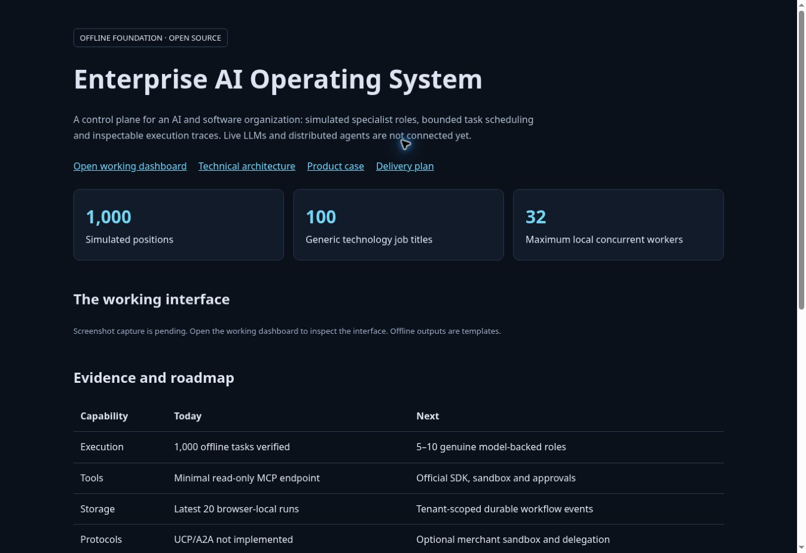

# Enterprise AI Operating System

**An inspectable AI/software organization control-plane foundation with 1,000 simulated positions, bounded orchestration and a minimal MCP tool gateway.**

[GitHub Pages overview](https://vivekmlresearch.github.io/enterprise-ai-os/) · [Open working dashboard](https://enterprise-ai-os.vivekmlresearch.chatgpt.site) · [Architecture](ARCHITECTURE.md) · [Product case and benefits](PRODUCT-CASE.md) · [16-week program plan](PROGRAM-PLAN.md) · [MIT license](LICENSE)

> Status: offline prototype. The registry contains 1,000 logical positions, not 1,000 connected LLM agents. Outputs are deterministic templates. No real model, distributed worker cluster, UCP merchant or A2A service is connected. This project is independent and does not represent Google or any other company's employees or internal organization.

## Published overview



## Interface screenshots

Screenshot capture is pending: the execution environment lacks an installed Chromium runtime and its download failed. No synthetic screenshot is presented as a real application capture. Planned captures: mission overview, role registry, and offline execution trace. The working interface is available at the dashboard link above.

## Why this project

Enterprise AI work requires more than model prompting: task state, role ownership, tool permissions, failure recovery, cost accounting and evidence-based acceptance. This repository establishes the interface, contracts and roadmap for those capabilities while making current limitations visible.

## Organization

100 generic job titles are assigned across ten departments and repeated across ten teams per department, for 1,000 positions. Stable IDs distinguish repeated roles.

| Department | Example roles | Positions |
|---|---|---:|
| AI Research | Principal Research Scientist, LLM Research Scientist | 100 |
| Data Science & Analytics | Principal Data Scientist, Data Analyst | 100 |
| Software Engineering | Principal Software Engineer, Distributed Systems Engineer | 100 |
| ML Platform & Inference | Principal ML Engineer, GPU Systems Engineer | 100 |
| Data Engineering | Principal Data Engineer, Knowledge Graph Engineer | 100 |
| Cloud Infrastructure & SRE | Principal Infrastructure Engineer, SRE | 100 |
| Security & Responsible AI | Principal Security Engineer, AI Red Team Engineer | 100 |
| Product & Design | Principal Product Manager, UX Researcher | 100 |
| Technical Program Management | Principal Technical Program Manager, AI Program Manager | 100 |
| Quality & Developer Experience | Principal Quality Engineer, AI Evaluation Engineer | 100 |

Role names are taxonomy only. Distinct role prompts, model-backed workflows and management hierarchy remain roadmap work.

## Implemented vs planned

| Capability | Implemented | Next step |
|---|---|---|
| Role registry | Search, department filters, pagination and stable IDs | Versioned role contracts and capabilities |
| Orchestration | Request-local pool, max 32 workers, max 1,000 allocated identities | Durable DAG, queue, retry, cancellation |
| Results | Per-role templates, measured orchestration timing, JSON export | Genuine model outputs with evidence |
| History | Latest 20 runs in browser localStorage | Tenant-scoped server event store |
| MCP | Minimal read-only JSON-RPC endpoint | Official SDK transport and conformance |
| Policy | Input limits and explicit offline payment denial | RBAC/ABAC, sandboxing, approvals, budgets |
| Google UCP | Not implemented | Optional merchant sandbox integration |
| A2A | Not implemented | Remote discovery and delegation |
| Scale | 1,000-task local correctness test | Distributed inference/load/recovery testing |

## Source distribution

The complete source is published as [enterprise-ai-os-publication-draft.zip](enterprise-ai-os-publication-draft.zip). Extract it before running the commands below. Individual source files have not yet been imported into the root tree. The automated import was blocked by approval review; no write-enabled import workflow was committed.

## Quick start

Prerequisite: Node 22.13+ (Node 24 recommended), package manager pinned in package.json.

```bash
corepack enable
pnpm install --frozen-lockfile
pnpm dev
```

Open the local URL printed by the dev server. The frontend and API routes must run together. The inherited starter uses Vinext/Vite and emits Cloudflare Workers-compatible server output.

```bash
node --experimental-strip-types tests/engine.test.ts
pnpm exec tsc --noEmit
pnpm build
```

The source archive includes a GitHub CI example for the dependency-free engine test; it is not installed in the root repository. Local type/build validation requires installed dependencies. Managed Sites helpers are included as upstream starter tooling; a standalone deployment requires hosting-specific configuration. The public repository intentionally excludes the original Site identity, tokens and environment files.

## APIs

```bash
curl -X POST http://localhost:3000/api/run \
  -H 'Content-Type: application/json' \
  -d '{"task":"Assess an enterprise LLM platform","count":10,"concurrency":4,"action":"analysis"}'

curl -X POST http://localhost:3000/api/mcp \
  -H 'Content-Type: application/json' \
  -d '{"jsonrpc":"2.0","id":1,"method":"tools/list"}'
```

Replace the port with the printed development port. MCP tools are `agents_list` and `catalog_search` (synthetic data). See [API details and limits](ARCHITECTURE.md).

## Product goals and quantified value

Measured: 1,000 unique registry IDs, 1,000 completed offline tasks, peak concurrency 32, and 10/10 specific payment denials in tests. These do not establish reasoning quality, inference performance or enterprise safety.

Proposed pilot targets: 25% faster reviewed task completion, 30% less coordination effort, 95% required trace coverage, 80% independently accepted tasks without baseline degradation, and 20% lower cost per accepted task. None has been demonstrated.

Illustrative assumptions (50 users × 20 tasks/month × 30 minutes/task × 25% effort reduction) yield **125 hours/month** of released capacity. At $50/hour that is $6,250 gross value/month; deducting assumed recurring cost of $2,100 gives $4,150 net capacity value/month. This is a scenario, not a measured ROI claim. [Read formulas, sensitivity and validation plan](PRODUCT-CASE.md).

## Delivery roadmap

Proposed kickoff: 5 October 2026. Sixteen-week baseline completion: 24 January 2027; separate two-week contingency to 7 February. Assumes a staffed engineering team, not a solo developer.

1. Weeks 1–2: contracts, scope, threat model and baseline tasks.
2. Weeks 3–4: 5–10 genuine model-backed specialist roles.
3. Weeks 5–6: durable workflow execution and persistent events.
4. Weeks 7–8: identity, tenant isolation, official MCP SDK and safe tools.
5. Weeks 9–10: quality evaluation, cost controls and observability.
6. Weeks 11–12: measured user pilot.
7. Weeks 13–14: scale tests and optional A2A/UCP adapters.
8. Weeks 15–16: recovery drills, runbooks and release gates.

[Detailed owners, dependencies, acceptance criteria and risks](PROGRAM-PLAN.md).

## Framework evolution

Retain the React/TypeScript UI. Evaluate LangGraph for role workflows, Temporal for durable execution, PostgreSQL for state, official MCP SDKs for tools, OpenTelemetry for traces, and Python/FastAPI for ML services when needed. Use local compatible inference or approved cloud model providers. These frameworks are recommendations, not current installed integrations. Pin validated releases and review licenses before adoption.

## GitHub Pages

`index.html` is a static technical/product overview linking to the working dashboard. The overview is served from the main branch root using GitHub Pages. The source archive includes optional CI/Pages workflow examples, but they are not installed in this repository. GitHub Pages cannot host this app's server API; it is not a second backend deployment. A GitHub Pages URL should be announced only after deployment succeeds.

## License and contribution

Project-authored code/documentation: MIT. Dependencies and starter material retain upstream licenses; see [third-party notices](THIRD_PARTY_NOTICES.md). No model weights or private training data are distributed. Contributions should include meaningful acceptance evidence and preserve the distinction between simulated and real capabilities. See [contributing](CONTRIBUTING.md) and [security](SECURITY.md).
